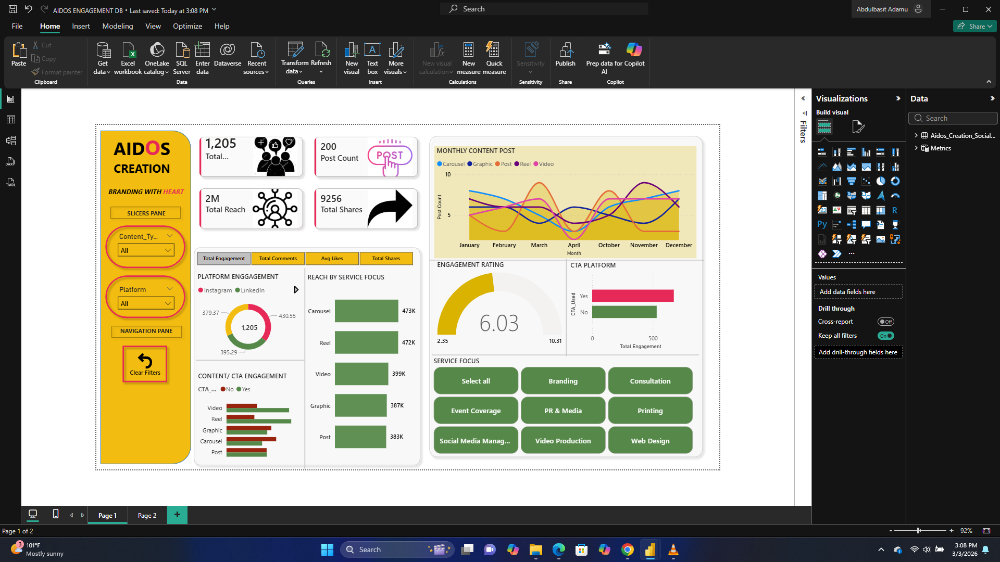

# AIDOS Engagement Analytics Dashboard

This project showcases an interactive Power BI dashboard designed to analyze engagement data and uncover trends that support insight-driven decision-making.

---

## Project Overview
The AIDOS Engagement Analytics Dashboard consolidates engagement metrics into a single, intuitive report. It enables stakeholders to quickly assess performance, monitor trends over time, and explore engagement patterns through interactive visuals.

This project demonstrates end-to-end Power BI development, from data transformation to modeling and visualization.

---

## Tools & Technologies
- Power BI  
  - Power Query  
  - DAX  
  - Data Modeling  

---

## Key Features
- Interactive dashboards with drill-down capabilities  
- Clear visualization of engagement trends over time  
- KPI-focused layout for quick insights  
- User-friendly design for non-technical stakeholders  

---

## Repository Contents
- `AIDOS ENGAGEMENT DB.pbix` – Power BI report file  
- Dashboard screenshots – Visual preview of the report  
- `README.md` – Project documentation  

---

## How to View the Dashboard

See the full dashboard here - [App Power Bi Link](https://app.powerbi.com/links/Pui-k1YngV?ctid=da850715-bf86-4983-ae11-1756ac3d9894&pbi_source=linkShare)

- Download the `.pbix` file and open it using **Power BI Desktop**    

---

## Notes
This project is intended for portfolio demonstration purposes. The data used is non-sensitive and structured to highlight analytical and visualization skills.

---

## Author
**Abu Ammar**  
Data Analyst | Business Intelligence
